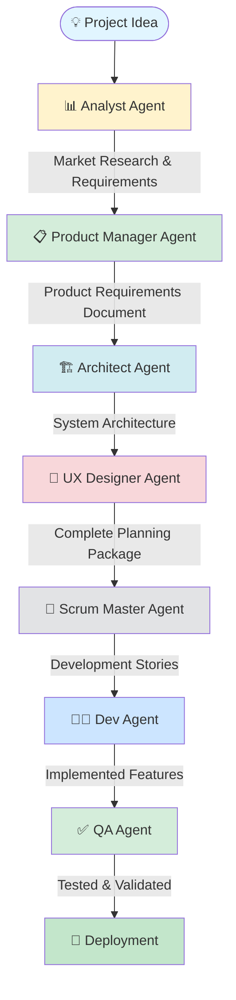

## Starting Fresh: My First Greenfield Project with BMAD

I'll be honest—when I first heard about BMAD Method, I was skeptical. Another AI tool promising to revolutionize development? Yeah, right. But after building my first project from scratch with it, I'm kind of blown away.

Here's the thing: we've all been there. You have this idea that won't leave you alone. Maybe it's a SaaS product, maybe a mobile app, or just something that would make your life easier. You're pumped to build it, but then reality hits. You need to validate the market, write requirements, design the architecture, plan the UX, implement features, write tests... and if you're a solo dev or small team, that's a lot of hats to wear.

What if you could have a PM, architect, and QA engineer on tap—without the payroll? That's basically what BMAD gives you. I'm going to walk you through exactly how I built my last project using this method, mistakes and all.

## How BMAD Actually Works

Look, BMAD isn't magic—it's just really well thought out. The workflow breaks down into two phases that actually make sense:

**Phase 1: Planning (happens in a web UI)**  
This is where you're basically brainstorming with AI agents that act like different team members. You'll validate your idea, write requirements, and design the system architecture. Think of it as the "what are we building and why" phase.

**Phase 2: Development (happens in your IDE)**  
This is where you actually build the thing. AI agents help break down all that planning into actual code. The cool part? They remember everything from Phase 1, so you're not constantly re-explaining context.

Here's the complete workflow visualized:



## Getting BMAD Set Up (It's Easier Than You Think)

Installation is stupidly simple. Seriously, I was expecting some multi-step nightmare, but it's just:

```bash
npx bmad-method install
```

That's it. It sets up all the agents and gets everything configured. If you've already got BMAD and just need to update:

```bash
git pull
npm run install:bmad
```

Not ready to install anything yet? I get it. You can actually try BMAD without installing by using the Web UI:
- Make a Gemini Gem or CustomGPT
- Upload the BMAD bundle
- Start chatting

I'd recommend trying the web version first just to see if you vibe with it before committing to a full install.

## Phase 1: Planning - Turning Ideas Into Actual Plans

For this walkthrough, I'm going to use **TaskFlow**—a task manager with AI prioritization that I actually built. (Yes, another task manager. I know, I know. But hear me out—the AI prioritization part actually turned out pretty cool.)

Feel free to follow along with your own idea. The process is the same whether you're building the next Notion or just a tool to organize your Spotify playlists.

### Step 1: Talk to the Analyst (AKA Reality Check Time)

**Takes about**: 20-30 minutes  
**Where**: BMAD Web UI

First up is the Analyst agent. Think of this as the friend who asks uncomfortable questions about your startup idea—except it won't ruin Thanksgiving dinner.

Type `*analyst` to get started.

Here's roughly how my conversation went:

```
Me: I want to build a task manager with AI prioritization 
    called TaskFlow.

Analyst: Interesting! Let me dig into this. Who's your target 
         audience? What makes this different from Todoist, 
         Notion, or the 47 other task managers out there?

Me: [Proceeds to explain my brilliant idea...]

Analyst: [Comes back with actual market data, competitors I 
         hadn't thought of, and some questions that made me 
         rethink a few things]
```

What you get out of this:
- Reality check on whether people actually want this
- Who you're competing against (prepare to be humbled)
- Your actual target audience
- Stuff that could go wrong
- Whether this is worth your time

Real talk: I almost killed TaskFlow at this stage because the Analyst pointed out that the market was pretty saturated. But it also helped me realize my AI angle was actually differentiated enough to be interesting. Better to find that out in 30 minutes than 3 months, right?

### Step 2: Build a PRD with the Product Manager

**Takes about**: 30-45 minutes  
**Where**: BMAD Web UI

Okay, so your idea survived the Analyst's scrutiny. Now it's time to actually define what you're building. Enter the PM agent.

Type `*pm` and let's go.

This is where things get real. The PM agent basically interviews you about your product and turns it into an actual Product Requirements Document. Not the one-paragraph kind you scribble in Notion—an actual, detailed PRD that you'd be proud to show investors (or at least not embarrassed to show your teammates).

The conversation is pretty collaborative:

```
Me: Let's create a PRD for TaskFlow based on what the Analyst found.

PM: Cool. Let's start with your core features. What's the MVP 
    vs. what's nice-to-have?

Me: [Starts listing features, gets a bit carried away...]

PM: Hold up. Let's focus on MVP. You said AI prioritization is 
    the key differentiator—let's nail that first.
```

I'm not going to lie, the PM agent saved me from myself here. I was ready to build like 20 features for v1. It helped me focus on what actually mattered.

You'll end up with:
- User stories (the "As a user, I want..." format that actually makes sense)
- Acceptance criteria (so you know when you're done)
- MVP vs. future features (scope control is real)
- Success metrics (how you'll know if anyone cares)
- Non-functional stuff (performance, security, etc.)

**Example User Story**:
```
As a busy professional, I want AI to automatically prioritize my 
tasks based on deadlines, importance, and dependencies, so that 
I can focus on what matters most without manual organization.

Acceptance Criteria:
- System analyzes task metadata (deadline, tags, dependencies)
- AI suggests priority scores (1-5)
- User can accept or override AI suggestions
- Prioritization updates in real-time as tasks change
```

### Step 3: Get Technical with the Architect

**Takes about**: 45-60 minutes (grab coffee for this one)  
**Where**: BMAD Web UI

This is where things get interesting if you're a tech nerd like me. The Architect agent is basically that senior engineer you wish you could ping on Slack at 2 AM.

Hit `*architect` and buckle up.

My conversation looked something like this:

```
Me: Design the system architecture for TaskFlow.

Architect: Based on your PRD, here's what I'm thinking:
           - React + TypeScript for the frontend
           - Node.js/Express backend
           - PostgreSQL database
           - OpenAI API for the AI stuff
           - Docker + AWS for deployment
           
           Thoughts?

Me: Why PostgreSQL over MongoDB?

Architect: Your task relationships and dependencies need proper
           relational integrity. Plus you'll want ACID compliance
           for task updates. NoSQL would be messier here.

Me: Fair point. What about scaling?

Architect: [Proceeds to explain caching strategy, database 
           indexing, horizontal scaling approach...]
```

Here's the cool part—the Architect doesn't just throw random tech at you. It actually justifies the choices based on your specific requirements from the PRD.

You get:
- Complete tech stack with actual reasoning (not just "React because React")
- Database schema that makes sense
- API design (endpoints, request/response formats)
- Security stuff (auth, data protection, all that fun compliance things)
- How you'll scale when you go viral (we can dream, right?)

Don't be shy about challenging the recommendations. I went back and forth on a few things, and the architecture got way better because of it.

### Step 4: UX Planning (Don't Skip This)

**Takes about**: 30-45 minutes  
**Where**: BMAD Web UI

I'll admit it—I almost skipped this step. "I'll just wing the UI," I thought. Past me was an idiot.

Type `*ux` before you make the same mistake.

The UX Designer agent doesn't create pixel-perfect mockups (it's text-based), but it helps you think through the actual user experience. Like, how does someone actually use this thing?

```
Me: Plan the UX for TaskFlow.

UX Designer: Let's start with the core user journey. Someone 
             opens the app—what do they see first?

Me: Uh... their tasks?

UX Designer: Okay, but empty state? First-time user? Power 
             user with 500 tasks? These are different scenarios.

Me: [Realizes I hadn't thought about this...]
```

What you get:
- User flows (the path someone takes to do stuff)
- Screen layouts (what goes where and why)
- Navigation structure (how people move around)
- Interaction patterns (buttons, forms, all that)
- Accessibility considerations (because we're not monsters)

This saved me from so many "why did I build it like this?" moments later.

### Planning Phase Done ✅

Take a breath. You now have:
- ✅ Validated idea (you're not completely crazy)
- ✅ Detailed PRD (you know what you're building)
- ✅ System architecture (you know how to build it)
- ✅ UX plan (you know what it should feel like)

Save all these documents. Seriously. They're your project bible. You'll refer back to them constantly during development.

## Phase 2: Actually Building the Thing

Alright, planning is done. Time to write some code. Open up your IDE—this is where it gets fun.

### Step 5: Breaking It Down with the Scrum Master

**Takes about**: 30 minutes  
**Where**: Your IDE (VSCode, Cursor, whatever you use)

The Scrum Master agent is like that organized teammate who actually reads the PRD and breaks it into manageable chunks. You know, unlike the rest of us who just start coding and hope for the best.

In your IDE, tell it:

```
Create development stories from the TaskFlow PRD.
```

The Scrum Master reads all those planning docs you made and creates story files. Each one is like a detailed todo item, but actually useful.

Each story has:
1. Why you're building this (business context)
2. How to build it (technical specs)
3. How you'll know it's done (acceptance criteria)
4. What else needs to be done first (dependencies)
5. Weird edge cases to think about

**Example Story File**: `stories/001-user-authentication.md`

```markdown
# Story 001: User Authentication

## Business Context
Users need to securely create accounts and log in to access 
their personalized task lists. This is foundational for all 
other features.

## Technical Specifications
- Implement JWT-based authentication
- Use bcrypt for password hashing
- Create User model in PostgreSQL
- Build /api/auth/register and /api/auth/login endpoints
- Store JWT in httpOnly cookies

## Acceptance Criteria
- [ ] User can register with email and password
- [ ] Password must meet complexity requirements
- [ ] User can log in with correct credentials
- [ ] Invalid credentials show clear error messages
- [ ] JWT token expires after 24 hours

## Dependencies
- Database schema setup
- Express server configuration

## Edge Cases
- Duplicate email registration attempt
- SQL injection attempts
- Extremely long password inputs
- Concurrent login attempts
```

You end up with a bunch of story files, nicely organized and prioritized. The Scrum Master even handles dependencies, so you're not trying to build feature 5 before feature 2 is done.

### Step 6: Let the Dev Agent Do Its Thing

**Takes**: Depends on complexity  
**Where**: Your IDE

This is the part that feels like magic. The Dev Agent actually writes code.

Just tell it which story to implement:

```
Implement story 001-user-authentication
```

Here's what blew my mind: the Dev Agent doesn't just generate random code. It knows:
- The business context from the PRD
- The architecture decisions from the Architect
- The UX requirements from the Designer
- The specific acceptance criteria from the story

So the code it writes actually makes sense in the context of your entire project.

What you get:
- Code that actually works (most of the time)
- Proper error handling
- Comments that explain the complex parts
- Code that follows the architecture you planned

Your job is to review it. I usually:
- Read through the code
- Test it out
- Ask for changes if something feels off
- Make tweaks based on my preferences

Example from when I built TaskFlow:

```
Me: Implement story 001-user-authentication

Dev Agent: [Generates auth code with JWT, bcrypt, etc.]

Me: Can we add rate limiting? Don't want bot attacks.

Dev Agent: [Adds express-rate-limit middleware]
```

It's collaborative. You're still in control, but you're not writing every line from scratch.

### Step 7: QA Agent Keeps You Honest

**Takes**: 15-30 minutes per feature  
**Where**: Your IDE

Look, I know writing tests is boring. But the QA Agent makes it way less painful.

```
Test the user authentication feature against story 001
```

The QA Agent:
1. Reads the acceptance criteria from the story
2. Writes actual test cases
3. Tests the edge cases you forgot about
4. Makes sure the feature actually does what the PRD said it should

What you get:
- Test suites you'd actually be proud to show someone
- Coverage reports
- Bug reports (yes, there will be bugs)
- Confirmation that you actually built what you said you would

I found a bunch of edge cases I hadn't thought about. Like, what happens when someone tries to register with a 10,000 character password? (Spoiler: my initial implementation crashed. The QA Agent caught it.)

**Example Test Suite**:

```javascript
describe('User Authentication', () => {
  test('User can register with valid email and password', async () => {
    // Test implementation
  });

  test('Registration fails with duplicate email', async () => {
    // Test implementation
  });

  test('Login succeeds with correct credentials', async () => {
    // Test implementation
  });

  test('Login fails with incorrect password', async () => {
    // Test implementation
  });

  test('JWT token is properly generated and validated', async () => {
    // Test implementation
  });
});
```

### Step 8: Rinse and Repeat

You just keep going through stories:
1. Dev Agent implements
2. QA Agent tests
3. You review
4. Next story

Since the Scrum Master organized everything by dependencies, you're not stuck trying to build something that needs a feature you haven't written yet. It just... flows.

This is honestly the most zen I've ever felt during development. No decision paralysis about what to build next. Just follow the stories.

## Shipping It: Deployment Time

Alright, your stories are done, tests are passing. Time to deploy and see if anyone actually uses this thing.

### Pre-Launch Checklist (Don't Skip These)

**Infrastructure**:
- [ ] Production environment set up (I used AWS, but Vercel/Heroku works too)
- [ ] Environment variables configured (please tell me you're not hardcoding API keys)
- [ ] Database is actually ready for production
- [ ] CDN configured if you need it

**Security** (this is the stuff that'll wake you up at 3 AM if you forget):
- [ ] HTTPS enabled (it's 2025, come on)
- [ ] CORS configured properly
- [ ] Rate limiting in place
- [ ] Auth/authorization actually works

**Monitoring** (how you'll know when things break):
- [ ] Error tracking set up (Sentry is my go-to)
- [ ] Logging configured
- [ ] Uptime monitoring
- [ ] Alerts that'll ping you when stuff goes wrong

**Performance**:
- [ ] Database queries optimized (N+1 queries are the enemy)
- [ ] Caching where it makes sense
- [ ] Assets compressed
- [ ] CDN working

The Architect's deployment doc from Phase 1 will have most of this mapped out already. Follow that.

## The Reality Check: How Long Did This Actually Take?

Let me give you the real timeline for TaskFlow. No BS, no "I coded it in a weekend" nonsense.

**Week 1: Planning**
- Monday: Analyst session (2 hours, mostly while drinking coffee)
- Tuesday: PRD with PM (3 hours, got interrupted by Slack a lot)
- Wednesday: Architecture design (4 hours, went deep on database schema)
- Thursday: UX planning (3 hours)
- Friday: Reviewed everything, made some tweaks (2 hours)

**Week 2-3: Building**
- Auth system: 1 day (faster than I expected)
- Basic task CRUD: 2 days (styling took longer than logic)
- AI prioritization: 2 days (OpenAI API integration was smooth)
- UI polish: 3 days (perfectionism is real)
- Testing and fixing bugs: 2 days (found more issues than I wanted to)

**Week 4: Launch Prep**
- Production setup: 1 day (AWS, Docker, all that fun)
- Final testing: 1 day (paranoid testing is best testing)
- Writing docs: 1 day (future me will thank present me)
- Launched! 🚀

**Total: About 4 weeks** as a solo dev working evenings and weekends. 

With traditional development (no BMAD), this would've been 2-3 months easy. I would've wasted at least a week just writing requirements and architecture docs manually. Another week dealing with context switching and trying to remember why I made certain decisions.

## Why BMAD Actually Works (The Honest Version)

### 1. Context Doesn't Disappear Into the Void
You know how you ask ChatGPT to help with code and it has no idea what the rest of your project does? Yeah, that doesn't happen here. The Dev Agent knows why you're building something (PRD), how it should fit (Architecture), and what done looks like (acceptance criteria). No more "I don't have enough context" messages.

### 2. No More "Wait, What Did We Decide?"
The planning phase creates actual documentation that everyone (well, every agent) follows. No more "I think we said we'd use MongoDB?" when you actually decided on PostgreSQL. It's all written down, consistent, and actually referenced.

### 3. You Can Trace Your Steps
Ever look at code you wrote 2 months ago and think "why the hell did I do it this way?" With BMAD, you can trace any code back to the story, back to the PRD requirement, back to the original idea. It's all connected. Debugging becomes way less of a mystery.

### 4. It's Like Having a Senior Dev on Every Role
The Architect agent gives you better system design than "just use microservices bro." The PM agent writes better requirements than your half-baked feature notes. The QA agent catches edge cases you didn't even know existed. It's specialized expertise across the board.

### 5. Scales Without Falling Apart
Whether you're building a weekend project or a full SaaS platform, the workflow stays the same. More features just means more stories. The structure handles complexity without turning into chaos.

## Things I Wish I Knew Before Starting

### Ship the MVP, Not the Dream
My first instinct was to plan everything—all the features I'd ever want. The PM agent gently steered me toward MVP thinking, and it saved me. Ship v1, get feedback, iterate. BMAD makes adding features later super easy because the foundation is already solid.

### The Agents Are Smart, But You're Still the Boss
Don't just accept everything the agents suggest. I pushed back on the Architect's initial database design, and we landed on something way better. The agents are there to help you think, not to think for you.

### Update the Docs or Suffer Later
If you make changes during development, update your PRD and Architecture docs. I got lazy once and made a quick architectural change without documenting it. Came back a week later and was totally confused. Don't be like me.

### The Community is Clutch
Join the BMAD Discord. Seriously. I was stuck on something dumb for an hour, asked in Discord, and someone helped me in like 5 minutes. The YouTube tutorials are solid too.

### Play with the Commands
Type `*help` in the Web UI and see what's available. When you're confused about the workflow, use `#bmad-orchestrator` to ask questions. There's a lot of power in there once you know where to look.

## Final Thoughts

Building TaskFlow with BMAD was honestly different from any project I've done before. I've built stuff the traditional way, I've used various AI coding assistants, but this was something else.

The biggest difference? I wasn't fighting the development process. No "what should I build next?" paralysis. No "wait, why did I design it this way?" confusion. No "I hope this is what users actually want" uncertainty.

The planning phase gave me clarity. The development phase gave me momentum. And the whole thing actually finished instead of joining my graveyard of half-built projects.

**Is it faster?** Hell yes. TaskFlow took me 4 weeks instead of 2-3 months.

**Is it better?** The code is cleaner, better tested, and way more maintainable than my usual solo projects.

**Is it perfect?** No. I still had to debug stuff, make decisions, and occasionally question my life choices. But those moments were way fewer and less painful.

If you're sitting on an idea, give BMAD a shot. Install it, try the web UI version, whatever. Just try it. Because honestly, after building with it, going back to the old way feels like coding with one hand tied behind my back.

Now if you'll excuse me, I have to go build the next thing. (I may have gotten addicted to shipping fast.)

## Resources to Get Started

- **BMAD on GitHub**: [github.com/bmad-code-org/BMAD-METHOD](https://github.com/bmad-code-org/BMAD-METHOD)
- **Quick Install**: Just run `npx bmad-method install`
- **Discord Community**: Where I got unstuck multiple times
- **YouTube Channel**: [BMadCode](https://youtube.com/@bmadcode) has solid walkthroughs

---

**Building something with BMAD?** Drop a comment and let me know what you're working on. I'm curious to see what people build with this.

Also, next blog post will be about adding BMAD to an existing project (brownfield), since most of us have legacy code we're dealing with. Stay tuned.

_#BMadMethod #GreenFieldDevelopment #AIAssistedDevelopment #FromIdeaToDeployment #AgileAI_

