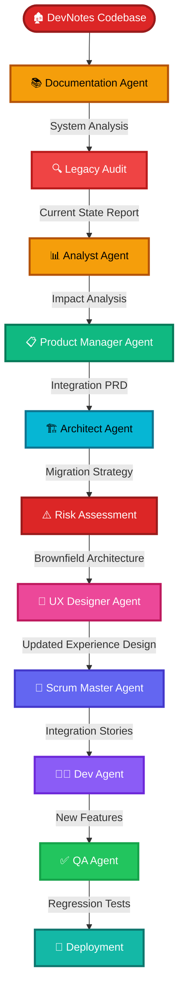
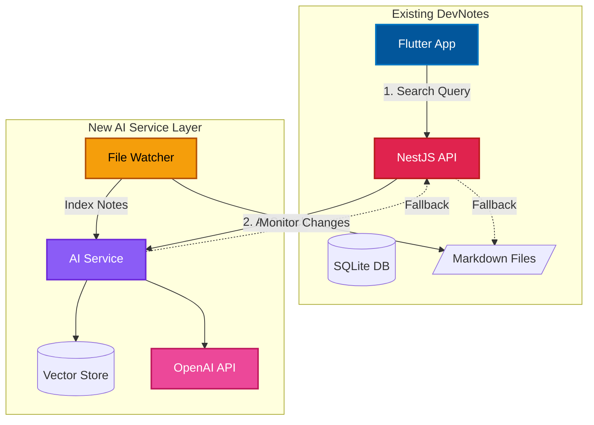

## The Legacy Code Reality Check

Remember my greenfield TaskFlow project? Yeah, that was the fun part. This time, I had to deal with something way more... let's call it "character-building."

Two years ago, I built **DevNotes**—a personal knowledge base for tracking my development projects, code snippets, learning resources, and random ideas. It started simple: markdown files, basic tagging, search. But like all side projects that actually get used, it grew organically (read: chaotically). I added features whenever I needed them, refactored when I felt like it, and left comments like `// TODO: fix this later` that are still there.

Now I wanted to add something ambitious: **AI-powered organization and suggestions**. Automatically categorize notes, suggest related content, identify knowledge gaps, maybe even summarize long articles. Cool features, but they needed to integrate into a codebase I barely remembered writing.

If you've ever looked at your own code from two years ago and thought "who wrote this garbage?" (narrator: it was you), you know the feeling. It's like opening a closet you haven't touched in years—you know there's useful stuff in there, but also some questionable decisions and possibly a few things that should've been thrown out ages ago.

Here's how BMAD Method helped me actually add features to my own legacy code without rage-quitting.

## Brownfield vs. Greenfield: Why It's a Different Beast

Let me be real about the difference:

**Greenfield** (building from scratch):
- Clean slate, endless possibilities
- You make all the decisions
- No technical debt... yet
- Main problem: "What should I build?"

**Brownfield** (working with existing code):
- Existing codebase with "personality"
- Legacy decisions you have to live with
- Technical debt is your roommate now
- Main problem: "How do I not break everything?"

With greenfield, you're an architect designing a dream home. With brownfield, you're a contractor renovating a house built in 1973 where the previous owner thought load-bearing walls were "more of a suggestion."

The BMAD workflow for brownfield is different because it has to be. You can't just dive in and start coding. You need to understand what you're working with first.

## The Brownfield BMAD Workflow

Here's the complete workflow visualized. Notice how it starts differently from greenfield:



See that extra step at the beginning? That's documentation and legacy audit. You can't skip this. Trust me, I tried.

## Understanding the BMAD Agents (Your AI Team)

Before we dive in, let's talk about WHO you're working with. BMAD gives you a team of specialized AI agents. Each one has a specific job, like actual team members:

### Planning Phase Agents (Web UI)

**📊 Analyst Agent** - The Reality Checker
- **What they do**: Validate your idea, research market, identify risks
- **How to invoke**: Type `*analyst` in BMAD Web UI
- **Output**: Feasibility analysis, market research, risk assessment
- **Think of them as**: That honest friend who asks uncomfortable questions

**📋 Product Manager (PM) Agent** - The Requirements Writer
- **What they do**: Create detailed PRDs, define features, set priorities
- **How to invoke**: Type `*pm` in BMAD Web UI
- **Brownfield tasks**: `*create-brownfield-prd` for existing projects
- **Output**: Product Requirements Document with user stories
- **Think of them as**: PM who actually writes good documentation

**🏗️ Architect Agent** - The Technical Designer
- **What they do**: Design system architecture, choose tech stack, plan integrations
- **How to invoke**: Type `*architect` in BMAD Web UI
- **Brownfield tasks**: `*create-brownfield-architecture` for existing systems
- **Output**: Architecture docs, database schema, API design
- **Think of them as**: Senior engineer who's seen this before

**🎨 UX Designer Agent** - The User Experience Planner
- **What they do**: Plan user flows, screen layouts, interaction patterns
- **How to invoke**: Type `*ux` in BMAD Web UI
- **Output**: UX specifications, user journey maps
- **Think of them as**: Designer who thinks about actual users

### Development Phase Agents (Your IDE)

**🔄 Scrum Master Agent** - The Story Breaker
- **What they do**: Break PRD into development stories, manage dependencies
- **How to invoke**: Natural language in IDE or `*create-brownfield-story`
- **Output**: Detailed story files with acceptance criteria
- **Think of them as**: Organized teammate who reads the docs

**👨‍💻 Dev Agent** - The Code Writer
- **What they do**: Actually write code based on stories and architecture
- **How to invoke**: "Implement story 001" or natural language
- **Output**: Working code with tests and documentation
- **Think of them as**: Developer who follows the plan

**✅ QA Agent** - The Tester
- **What they do**: Write tests, find bugs, verify acceptance criteria
- **How to invoke**: `*review-story 001` or natural language
- **Output**: Test suites, bug reports, coverage analysis
- **Think of them as**: QA engineer who catches edge cases

### How They Work Together

The magic is that **agents remember context**:
- PM knows what Analyst found
- Architect knows what PM specified
- Dev knows what Architect designed
- QA knows what the acceptance criteria are

You're not copy-pasting context between ChatGPT tabs. They're actually collaborating.

### Where You Work

- **BMAD Web UI** (Planning): Analyst → PM → Architect → UX
  - Good for thinking and planning without code
  - Create CustomGPT or Gemini Gem with BMAD bundle
  
- **Your IDE** (Development): Scrum Master → Dev → QA
  - Direct access to your codebase
  - Reads your actual files
  - Makes real changes

### Brownfield-Specific Tasks

For existing projects, BMAD has **built-in utility tasks** (not tied to specific agents):
- `*document-project` - Analyze existing codebase (BMAD utility, runs in IDE)
- `*create-brownfield-prd` - Use with **PM Agent** for existing systems
- `*create-brownfield-architecture` - Use with **Architect Agent** for integration
- `*create-brownfield-story` - Use with **Scrum Master Agent** for stories

**Key difference**: 
- Agent commands (`*analyst`, `*pm`, etc.) → You talk to a specific agent
- Utility tasks (`*document-project`) → BMAD analyzes your code directly
- Combined tasks (`*create-brownfield-prd`) → Tell the agent this is brownfield

Think of `*document-project` like running a diagnostic tool - it scans your code and creates documentation. You don't need to "talk" to it like you would with the PM agent.

Okay, now that you know WHO does WHAT, let's actually use them.

## Phase 0: Understanding What You Have (The Archaeology Phase)

This is the phase that doesn't exist in greenfield. Welcome to code archaeology.

### Step 0.5: Document the Existing System

**Takes about**: 2-4 hours (longer if the codebase is really "special")  
**Where**: Your IDE with BMAD  
**Task**: `*document-project` (built-in BMAD utility, not an agent)

Before you do anything else, you need to understand what you're working with. This is where BMAD's documentation capabilities shine.

In your IDE, run the BMAD documentation utility:

```
*document-project DevNotes
```

Or be more specific with natural language:

```
Analyze and document the DevNotes codebase architecture, 
focusing on note storage, tagging, and search systems.
```

This is a **utility task**, not an agent conversation. BMAD will automatically crawl through your codebase, analyze the code, and create documentation. You don't need to chat with it - it just scans and reports.

It's like having past-you explain everything to present-you, except without the embarrassment of admitting you don't remember your own decisions.

What you get:
- **Current architecture map** (what talks to what)
- **Tech stack inventory** (including those packages you installed once and forgot about)
- **Database schema as it actually exists** (not as you planned it)
- **API endpoints catalog** (the organized ones and the ones you added at midnight)
- **Dependencies and gotchas** (oh, so many gotchas)

**Real example from DevNotes**:

```
Current System Analysis:
├── Frontend: Flutter 3.x (mobile app, some desktop usage)
├── Backend: NestJS (TypeScript)
├── Database: SQLite (started simple, never migrated)
├── Search: Custom full-text search (reinvented the wheel)
├── File Storage: Local filesystem (notes as .md files)
├── Auth: Simple JWT (just for me, no OAuth)
├── Markdown: Custom parser + rendering
└── Tags: Stored as comma-separated strings (I know, I know)

Critical Dependencies:
- Search tightly coupled to file system structure
- Tags stored inconsistently (sometimes array, sometimes string)
- No API versioning (didn't think I'd need it)
- Custom markdown rendering widgets scattered across the app
- Cache invalidation is... optimistic at best
```

Yeah. Looking at this hurt a little. Past me made some *choices*.

### Step 0.7: The Legacy Audit (Face Your Fears)

**Takes about**: 1-2 hours  
**Where**: Your IDE  
**Task**: Code analysis (can use Dev Agent or natural language)

Now comes the uncomfortable part. You need a brutally honest assessment of what's broken, what's risky, and what's going to fight you.

In your IDE, ask BMAD to analyze the code quality:

```
Audit the DevNotes codebase for technical debt, 
security issues, and integration risks.
```

Or talk to the Dev Agent directly:

```
Analyze this codebase and identify technical debt, 
code smells, and potential issues.
```

BMAD will analyze the code and give you the bad news. Think of it as looking in a mirror after not sleeping for three days—honest, but painful.

**My DevNotes audit highlights**:

```markdown
## Technical Debt Inventory

### Critical Issues 🔴
- No test coverage (literally zero tests)
- Search algorithm breaks with special characters
- File system race conditions when saving notes
- Memory leaks in markdown parser

### Major Concerns 🟡
- Tags stored inconsistently (string vs array)
- No proper error handling (lots of silent failures)
- Frontend and backend share validation logic via copy-paste
- Configuration hardcoded in 5 different places

### Future Pain Points 🟠
- Vue 2 is EOL (migration will be painful)
- SQLite not suitable for concurrent writes
- No backup strategy (just YOLO and hope)
- Custom search can't scale beyond ~1000 notes

### Architecture Smells 👃
- Note service does everything (God object strikes again)
- Circular dependency between note and tag modules
- 3 different ways to parse markdown (why did I do this?)
- Comments like "// fix later" from 2 years ago
- Some variable names are just keyboard smashes
```

Not gonna lie, reading this hurt. It's one thing to know your code isn't perfect. It's another to have an AI agent politely list all your sins.

**Pro tip**: Do this audit alone. When you see `keyboardSmash: true` as an actual variable name you wrote, you don't need witnesses.

## Phase 1: Planning Your Integration Strategy

Now that you know what you're dealing with, time to plan how to add your new feature without setting everything on fire.

### Step 1: Reality Check with the Analyst

**Takes about**: 30-45 minutes  
**Where**: BMAD Web UI  
**Agent**: 📊 Analyst Agent

Remember the Analyst? The reality checker who asks uncomfortable questions. Time to put them to work.

Type `*analyst` and let's validate this feature makes sense given your current situation.

My conversation went like this:

```
Me: I want to add AI-powered organization and suggestions to DevNotes.

Analyst: Interesting! Let's dig into this. What specific AI features 
         are you thinking?

Me: Auto-categorization, related note suggestions, maybe summarization, 
    identify knowledge gaps...

Analyst: That's... a lot. Given your current architecture, let's talk 
         about concerns:
         - Your search is already struggling
         - SQLite won't handle concurrent AI operations well
         - AI API calls will add latency
         - File-based storage makes training data extraction tricky
         
         What's the core problem you're trying to solve?

Me: Honestly? I have 500+ notes and can't find anything anymore.

Analyst: Perfect. Let's focus there. What if we start with AI-powered 
         smart search and auto-tagging? Get those working before 
         jumping to summarization and knowledge graphs?

Me: That's... way more achievable.
```

The Analyst helped me scope this down from "add all the AI" to "solve the actual problem I have." Probably saved me from abandoning this project in frustration.

### Step 2: Brownfield PRD with the Product Manager

**Takes about**: 45-60 minutes  
**Where**: BMAD Web UI  
**Agent**: 📋 PM Agent

This isn't like greenfield where you're defining everything fresh. The PM agent needs to understand what exists and what's changing.

Type `*pm` in the Web UI and specify this is brownfield:

```
*create-brownfield-prd

I want to add AI-powered search and auto-tagging to DevNotes, 
considering the existing architecture and technical constraints.
```

Or just use natural language with the PM agent:

```
Create a PRD for adding AI features to my existing DevNotes project.
```

The PM agent knows to ask different questions:

```
PM: Let's talk about integration points. Where will AI features 
    appear in the existing UI?

Me: Search bar should be AI-powered, and notes should auto-tag as I type.

PM: Okay. Your search already has performance issues. Adding AI 
    could make it slower. What's acceptable latency?

Me: Good point. Maybe 500ms for search? And auto-tagging can be async.

PM: Smart. Now, your notes are stored as files. How will the AI 
    access them? Do we need to change the storage model?

Me: Ugh, I don't want to migrate everything...

PM: We don't have to. We can build an indexing layer that reads 
    from files and creates embeddings. No migration needed.
```

This back-and-forth is crucial. The PM agent helps you think through the integration nightmare before you're knee-deep in regret.

**Key differences from greenfield PRD**:

```markdown
## Brownfield-Specific Sections

### Integration Points
- Existing search functionality
- File-based note storage system
- Flutter widgets (note editor, search bar)
- Tag management system

### Migration Strategy
- Phase 1: AI-powered search (minimal risk, additive)
- Phase 2: Auto-tagging for new notes
- Phase 3: Batch re-tagging of existing notes (after validation)

### Constraints
- Cannot migrate away from file storage (too much work)
- Must work with current Flutter version (major refactor separate project)
- Existing notes must remain readable without AI
- Running on personal devices (limited resources)

### Risk Mitigation
- Feature flags for gradual rollout
- Fallback to old search if AI fails
- Cache embeddings to reduce API calls
- Monitor performance and API costs closely
- AI features are enhancements, not requirements

### Acceptance Criteria with Regression Testing
- New features work as specified
- **Existing note editing flow not affected**
- **No increase in note load times**
- **Old search still works as fallback**
- **All existing notes remain accessible**
```

Notice all the "don't break my working notes" requirements? That's brownfield life when it's your own tool.

### Step 3: Architect Plans the Integration

**Takes about**: 60-90 minutes (this is the critical part)  
**Where**: BMAD Web UI  
**Agent**: 🏗️ Architect Agent

Type `*architect` in the Web UI and buckle up for the technical deep dive.

```
*create-brownfield-architecture

Design architecture for integrating AI-powered search and 
auto-tagging into DevNotes without disrupting existing systems.
```

Or with natural language:

```
Design the architecture for adding AI features to DevNotes 
without breaking the existing file-based storage.
```

The Architect agent needs to solve a puzzle: how do you add AI to a simple app without turning it into a complicated mess?

My architecture conversation:

```
Architect: Looking at your file-based setup, I recommend creating 
           an AI service layer that sits alongside your existing 
           app. Keep them loosely coupled.

Me: So like... two separate apps?

Architect: Not quite. More like an indexing service that watches 
           your notes and builds AI-powered capabilities without 
           changing how you store files.

Me: What about when the AI service is down?

Architect: Your app works exactly like it does now. AI features 
           are progressive enhancement. The AI service reads your 
           files, creates embeddings, stores them separately.
           
           - Original notes stay as markdown files
           - AI service builds searchable index
           - If AI fails, fall back to current search
           - No data migration needed

Me: That's... actually way simpler than I thought.

Architect: Brownfield is about working *with* what you have, 
           not fighting it.
```

Here's the architecture that emerged:



**Key Brownfield Architecture Principles**:

1. **Isolation** - AI service doesn't modify original files
2. **Graceful degradation** - If AI fails, fall back to old search
3. **Feature flags** - Can disable AI features instantly if needed
4. **Monitoring** - Track API costs and performance impact
5. **Backwards compatibility** - App works exactly the same without AI

The Architect also gave me a migration plan:

```markdown
## Implementation Phases

### Phase 1: Foundation (Week 1)
- Set up AI service infrastructure
- Implement file watcher
- Build embedding index (offline, no UI changes)

### Phase 2: Soft Launch (Week 2)
- Add AI search endpoint
- Enable for my usage only
- Test thoroughly with real notes
- Monitor API costs and performance

### Phase 3: Expansion (Week 3-4)
- Add auto-tagging for new notes
- Gradually re-index existing notes
- Optimize based on actual usage patterns

### Rollback Plan
- Feature flag off = instant return to old search
- AI service can be stopped without affecting app
- Original files never touched (zero data loss risk)
```

This is way more detailed than greenfield because the stakes are higher. Break my note-taking system, lose important information. When it's your own tool, you're extra careful.

### Step 4: UX Design for Brownfield

**Takes about**: 30-45 minutes  
**Where**: BMAD Web UI  
**Agent**: 🎨 UX Designer Agent

Type `*ux` and let's figure out how to make AI features feel natural, not bolted on.

```
Design UX for AI search and auto-tagging that integrates 
seamlessly with DevNotes' existing interface.
```

The UX Designer agent asks about your current design:

```
UX Designer: Do you have a design system or style guide?

Me: Uh... I have some theme constants? It's pretty minimal.

UX Designer: Okay. Let's make sure AI features don't change 
             the core experience. Your current search is in 
             the app bar, right?

Me: Yeah, just a simple TextField widget.

UX Designer: Perfect. Keep it there. Maybe add a subtle indicator 
             when AI is active? Like a small sparkle icon?

Me: That could work. Should auto-tagging be visible?

UX Designer: Let's show suggested tags as you type, but make 
             them optional. Users can accept, modify, or ignore.
```

**Key brownfield UX considerations**:

```markdown
## UX Integration Strategy

### Existing Design Audit
- Current components to reuse
- Design patterns already established
- User expectations from current experience

### Placement Strategy
- Where new features fit naturally
- What might need to move or be removed
- How to maintain consistency

### Progressive Enhancement
- App works without recommendations (graceful degradation)
- New features feel native, not bolted on
- Maintain existing user workflows

### User Adaptation
- How to introduce new features without confusion
- Tooltips or onboarding needed?
- Can users ignore it if they want?
```

The UX Designer helped me realize I needed to keep the interface minimal—just enhance what's there rather than adding new sections. AI should be invisible until needed.

### Planning Phase Done ✅

You now have:
- ✅ Complete documentation of existing system
- ✅ Honest technical debt audit
- ✅ Brownfield PRD with integration plan
- ✅ Architecture that doesn't break everything
- ✅ UX that works with what you have

Compared to greenfield, this took longer. But the planning is even more critical because one wrong move and you're debugging production at midnight.

## Phase 2: Development (Carefully)

Time to actually build this thing. With brownfield, you're basically doing surgery on a running system. Fun!

### Step 5: Breaking It Down with Scrum Master

**Takes about**: 45 minutes  
**Where**: Your IDE  
**Agent**: 🔄 Scrum Master Agent

The Scrum Master creates stories, but brownfield stories are different. Each one needs to consider integration risks.

In your IDE, use the Scrum Master:

```
*create-brownfield-story

Create development stories for DevNotes AI features, 
prioritizing by integration risk and safety.
```

Or tell the Scrum Master directly:

```
Break down the AI feature implementation into stories, 
considering the brownfield constraints.
```

**Example Brownfield Story**: `stories/001-file-watcher-service.md`

```markdown
# Story 001: File Watcher Service Foundation

## Business Context
We need to monitor markdown files for changes and index them 
for AI-powered search WITHOUT modifying the existing file 
storage system or note editor.

## Technical Specifications
- Create standalone file watching service
- Monitor notes directory for file system changes
- Extract content and metadata from markdown files
- Store in separate vector database for embeddings
- Zero modifications to original files
- Must not impact note saving performance

## Brownfield Integration Points
- Watch existing notes directory (read-only)
- Parse markdown using existing parser library
- Extract metadata from frontmatter
- Zero breaking changes to file structure

## Acceptance Criteria
- [ ] File watcher detects new/modified notes
- [ ] Markdown content extracted correctly
- [ ] Metadata parsed from frontmatter
- [ ] **Existing note saving not affected**
- [ ] **Original files never modified**
- [ ] Service can be stopped without affecting app

## Risk Assessment
**Risk Level**: LOW
- Read-only file system access
- Service runs independently
- Failure doesn't affect note editing

## Rollback Plan
- Stop file watcher service
- Service failure doesn't affect main app
- Can delete index and start over if needed

## Dependencies
- Vector database setup (ChromaDB)
- Node.js fs.watch API
- Markdown parser (existing library)

## Testing Requirements
### Unit Tests
- File watcher functionality
- Markdown parsing accuracy
- Metadata extraction

### Integration Tests
- End-to-end indexing flow
- Graceful failure handling
- File system race conditions

### Regression Tests ⚠️
- **Existing note editing still works**
- **Note saving performance unchanged**
- **File integrity maintained**

## Edge Cases (Brownfield Specific)
- Notes being edited while watcher reads them
- Very large markdown files (>10MB)
- Special characters in filenames
- Symlinks and hidden files
- Files with no frontmatter
```

See the difference? Every story has:
- Integration points clearly marked
- Regression testing requirements
- Rollback plans
- Risk assessment

The Scrum Master prioritizes stories by risk:
1. Low risk, foundational work first
2. Medium risk, core features next
3. High risk, user-facing changes last

This is opposite from greenfield where you might build user-facing stuff first. With brownfield, you establish your foundation carefully before touching anything users see.

### Step 6: Dev Agent Implementation (With Safety Rails)

**Takes**: Depends on complexity  
**Where**: Your IDE  
**Agent**: 👨‍💻 Dev Agent

Time to code, but with more caution than greenfield.

Tell the Dev Agent in your IDE:

```
Implement story 001-file-watcher-service with emphasis on 
file safety and zero impact on existing functionality.
```

Or simply:

```
Implement story 001
```

The Dev Agent will read the story file and understand the brownfield constraints.

The Dev Agent knows this is brownfield, so it:
- Writes code that integrates without modifying existing code
- Adds extensive error handling
- Includes feature flags everywhere
- Adds monitoring and logging
- Creates rollback mechanisms

**Example code it generated**:

```javascript
// File watcher service - BROWNFIELD INTEGRATION
const fs = require('fs');
const path = require('path');
const chokidar = require('chokidar');

class FileWatcherService {
  constructor(notesDirectory) {
    this.notesDir = notesDirectory;
    this.watcher = null;
    this.isEnabled = false;
  }

  start() {
    // Feature flag check - can disable instantly if needed
    if (!featureFlags.isEnabled('ai-indexing')) {
      logger.info('AI indexing disabled via feature flag');
      return;
    }

    this.isEnabled = true;

    // Watch for file changes (read-only, zero modifications)
    this.watcher = chokidar.watch(this.notesDir, {
      persistent: true,
      ignoreInitial: false,
      ignored: /(^|[\/\\])\../, // ignore hidden files
      awaitWriteFinish: {  // Wait for writes to complete
        stabilityThreshold: 2000,
        pollInterval: 100
      }
    });

    this.watcher
      .on('add', filepath => this.handleFileChange(filepath, 'added'))
      .on('change', filepath => this.handleFileChange(filepath, 'modified'))
      .on('unlink', filepath => this.handleFileDelete(filepath))
      .on('error', error => {
        // Log but don't crash - brownfield principle
        logger.error('File watcher error', error);
        // Don't affect main app
      });

    logger.info(`File watcher started for ${this.notesDir}`);
  }

  async handleFileChange(filepath, changeType) {
    if (!this.isEnabled) return;

    try {
      // Read file safely (no modifications ever)
      const content = await fs.promises.readFile(filepath, 'utf-8');
      
      // Extract metadata and content
      const note = this.parseMarkdown(content);
      
      // Index asynchronously - don't block file system
      setImmediate(async () => {
        try {
          await indexer.indexNote({
            filepath,
            content: note.content,
            metadata: note.metadata,
            changeType
          });
        } catch (error) {
          logger.error(`Indexing failed for ${filepath}`, error);
          // Graceful degradation - don't crash
        }
      });
    } catch (error) {
      // File might be locked or deleted
      logger.warn(`Could not process ${filepath}`, error);
      // Continue watching other files
    }
  }

  stop() {
    if (this.watcher) {
      this.watcher.close();
      this.isEnabled = false;
      logger.info('File watcher stopped');
    }
  }
}

module.exports = FileWatcherService;
```

Notice:
- Feature flag check at startup
- Read-only file access (never modifies)
- Async indexing so it doesn't block
- Error handling that doesn't crash anything
- Can be stopped cleanly
- Waits for writes to finish before reading

This is brownfield coding: defensive, observable, and completely reversible.

### Step 7: Testing (More Tests, More Safety)

**Takes**: 30-45 minutes per feature  
**Where**: Your IDE  
**Agent**: ✅ QA Agent

Tell the QA Agent:

```
Test the file watcher service against story 001, including 
regression testing of existing DevNotes functionality.
```

Or use:

```
*review-story 001
```

The QA Agent generates three types of tests:

**1. New Feature Tests** (does your code work?)

```javascript
describe('File Watcher Service', () => {
  test('Detects new note files', async () => {
    // Test new functionality
  });

  test('Handles file read errors gracefully', async () => {
    // Test resilience
  });

  test('Parses markdown correctly', async () => {
    // Test parsing logic
  });
});
```

**2. Integration Tests** (does it play nice?)

```javascript
describe('Integration with Existing Note System', () => {
  test('Note saving still works with watcher running', async () => {
    const noteBefore = await saveNote('test.md', 'content');
    
    enableFeature('ai-indexing');
    const noteAfter = await saveNote('test2.md', 'content');
    
    expect(noteAfter.status).toBe('success');
  });

  test('Watcher does not affect note save performance', async () => {
    // Performance assertions
  });

  test('Large files handled without blocking', async () => {
    // Test with 10MB file
  });
});
```

**3. Regression Tests** (did you break anything?)

```javascript
describe('Regression Tests', () => {
  test('Existing note editing flow works', async () => {
    // Full edit simulation
  });

  test('Note searching still works', async () => {
    // Old search verification
  });

  test('Tag management unchanged', async () => {
    // Existing functionality verification
  });

  test('Original files never modified', async () => {
    // File integrity check
  });
});
```

The QA Agent also creates a regression test suite runner:

```bash
# Run existing tests to ensure nothing broke
npm run test:existing

# Run new feature tests
npm run test:ai-features

# Run integration tests
npm run test:integration

# Run full suite
npm run test:all
```

I caught several issues during testing:
- File watcher was trying to index hidden files (like .DS_Store)
- Markdown parser choked on files with no frontmatter
- Race condition when notes were saved while being read
- Memory leak from not closing file handles properly

Better to find this in testing than to corrupt my actual notes.

### Step 8: Incremental Rollout (Feature Flags Are Your Friend)

Unlike greenfield where you might just deploy, brownfield needs gradual rollout.

**Week 1: Infrastructure Only**
```
Phase: Foundation
Status: File watcher running, no UI changes
Risk: Low
Rollback: Simple (just stop service)
```

**Week 2: AI Search Testing**
```
Phase: AI-powered search
Status: Available but off by default
Risk: Medium
Rollback: Feature flag keeps old search
Monitoring: Check API costs and latency
```

**Week 3: Auto-tagging Preview**
```
Phase: Tag suggestions
Status: On for new notes only
Risk: Medium-Low (proven with search)
Rollback: Feature flag to disable
```

**Week 4: Full Features**
```
Phase: All AI features enabled
Status: Default for all notes
Risk: Low (already validated)
Rollback: Feature flag (but unlikely needed)
```

Feature flag implementation:

```dart
// Flutter Frontend
class SearchBar extends StatefulWidget {
  @override
  _SearchBarState createState() => _SearchBarState();
}

class _SearchBarState extends State<SearchBar> {
  final TextEditingController _controller = TextEditingController();
  Timer? _debounce;
  bool useAISearch = false;

  @override
  void initState() {
    super.initState();
    useAISearch = FeatureFlags.get('ai-search');
  }

  void _onSearchChanged(String query) {
    if (_debounce?.isActive ?? false) _debounce!.cancel();
    
    _debounce = Timer(const Duration(milliseconds: 300), () {
      _performSearch(query);
    });
  }

  Future<void> _performSearch(String query) async {
    if (useAISearch) {
      await aiSearchService.search(query);
    } else {
      // Fallback to old search
      await oldSearchService.search(query);
    }
  }

  @override
  void dispose() {
    _controller.dispose();
    _debounce?.cancel();
    super.dispose();
  }

  @override
  Widget build(BuildContext context) {
    return TextField(
      controller: _controller,
      onChanged: _onSearchChanged,
      decoration: InputDecoration(
        hintText: 'Search notes...',
        suffixIcon: useAISearch ? Icon(Icons.auto_awesome) : Icon(Icons.search),
      ),
    );
  }
}

// NestJS Backend
if (featureFlags.isEnabled('ai-indexing')) {
  await this.aiService.indexNote(note);
} else {
  // Just save normally
  await this.saveNote(note);
}
```

This saved me when I discovered my embedding API costs were way higher than expected. Flagged it off, optimized caching, re-enabled. Total note loss: zero. Total panic: minimal.

## The Reality: How Long Did This Take?

Let me be honest about the timeline. Brownfield takes longer than greenfield because you're working around constraints.

**Week 1: Understanding & Planning**
- Monday: Code documentation and legacy audit (3 hours, evening)
- Tuesday: Analyst session + PRD planning (3 hours)
- Wednesday: Architecture design (4 hours, lots of coffee)
- Thursday: UX planning + design audit (2 hours)
- Friday: Story creation + risk assessment (2 hours)

**Week 2-3: Building Foundation**
- File watcher service: 2 days (evenings, extensive testing)
- AI service setup: 3 days (OpenAI integration, vector database)
- Embedding indexer: 2 days (dealing with my weird markdown variations)
- Feature flag system: 1 day
- Monitoring and cost tracking: 1 day

**Week 4: Integration**
- AI search integration: 2 days (testing with my actual notes)
- Regression testing: 1 day (paranoid about corrupting notes)
- Performance optimization: 1 day (API costs were scary)
- Documentation: 1 day (for future me who will forget everything)

**Week 5-6: Rollout & Enhancement**
- AI search testing: 2 days (using it for real work)
- Bug fixes: 1 day (found a few edge cases)
- Auto-tagging feature: 2 days
- Batch re-indexing: 2 days (500+ notes took a while)
- Final polish: 1 day

**Total: About 6 weeks** working evenings and weekends.

Without BMAD? Honestly, this would've been 3-4 months minimum, or more likely I would've given up. I would've spent at least two weeks just trying to remember why I architected things the way I did. Another week building the wrong solution. And countless hours debugging when my hacky integration broke note saving.

The documentation and planning phase that BMAD forced me through saved me from so many painful debugging sessions.

## Why BMAD Saves Your Ass in Brownfield

### 1. Documentation That Actually Happens

Let's be honest: most legacy codebases have zero useful documentation. BMAD creates it for you by analyzing the actual code. Not what someone thought they built, but what actually exists.

This saved me multiple times when the "simple" integration turned out to have weird dependencies nobody remembered.

### 2. Risk Assessment Built In

The Architect and PM agents specifically think about integration risks. They ask questions like "what happens when this fails?" and "how does this affect existing performance?"

These are questions I probably would've skipped in my rush to start coding. And then regretted at 2 AM when production went down.

### 3. Regression Testing as First-Class Citizen

The QA Agent treats "don't break existing stuff" as seriously as "make new stuff work." It generates regression test suites automatically.

I found three bugs in existing functionality just by running these tests. Bugs that had been there for months, but my new tests finally caught them.

### 4. Incremental Integration Strategy

BMAD's Scrum Master creates stories that build up gradually from low-risk to high-risk. You're not just diving into user-facing changes on day one.

This meant I had a working backend for a week before touching the frontend. When the frontend integration had issues, I knew my backend was solid.

### 5. Rollback Plans Aren't Afterthoughts

Every story includes how to undo it. The Dev Agent includes feature flags and graceful degradation by default.

I actually had to use a rollback once. It took 30 seconds and zero panic because it was planned from the start.

## Common Brownfield Pitfalls (And How I Hit Some Of Them)

### Pitfall #1: Skipping the Documentation Phase

**What happened**: On my first story, I was eager and tried to skip the thorough documentation. "I wrote this code, I remember it, let's go!"

**Result**: Spent 4 hours debugging why the file watcher wasn't detecting changes. Turns out I had a custom file-saving function that wrote to a temp file first, then atomically moved it. The watcher was seeing the temp files, not the final files. The documentation phase would've caught this immediately.

**Lesson**: Don't skip Step 0. Just don't. Past you and present you are basically different people. Document everything.

### Pitfall #2: Underestimating Integration Complexity

**What happened**: I thought adding AI search would be simple. The Architect warned about API costs and latency, but I thought "it's just my personal notes, how expensive could it be?"

**Result**: First week of testing cost me $47 in OpenAI API calls because I was creating embeddings for every search query instead of caching them. Oops.

**Lesson**: Listen to the Architect agent's warnings. They're not being paranoid, they're preventing you from expensive mistakes.

### Pitfall #3: Not Testing Regression Thoroughly

**What happened**: I wrote great tests for AI features but ran the existing test suite only once at the end. Well, actually I had NO existing tests, so I wrote them during this process.

**Result**: Discovered that my file watcher was preventing notes from being deleted. The delete function worked, but the watcher kept re-indexing the "deleted" notes because it saw file system events.

**Lesson**: Run regression tests after every significant change. Even if you have to write them first. The QA Agent creates them for a reason.

### Pitfall #4: Not Documenting Existing Quirks

**What happened**: I found some weird behavior in my tag system (tags were sometimes arrays, sometimes comma-separated strings), worked around it, but didn't document why.

**Result**: Two weeks later, I forgot about the quirk and created a bug by "fixing" my workaround. Spent an hour debugging why tags weren't displaying correctly.

**Lesson**: Document every weird thing you discover about your own code. Future you has amnesia. Update the BMAD docs so the agents know about these quirks.

### Pitfall #5: Trying to Fix Everything At Once

**What happened**: While adding AI features, I noticed Vue 2 was deprecated, SQLite was the wrong choice, my custom search was garbage, and tags were a mess. I tried to fix all of it.

**Result**: Scope explosion. Three weeks of work turned into "maybe I should just rewrite everything?" which is how projects die.

**Lesson**: Stay focused on your feature. Make a separate backlog for tech debt (Vue 3 migration, database upgrade, tag refactor), but don't fix everything while adding AI. One thing at a time.

## Advanced Brownfield Techniques

### Strangler Fig Pattern

Once I had the AI service working as a separate layer, I realized this was a pattern I could use for other legacy parts of DevNotes.

The "Strangler Fig" pattern: gradually replace parts of a monolith by building new services around it, then slowly migrating functionality over. Like a fig tree that grows around a host tree.

BMAD's architecture agent understood this pattern and helped me identify other candidates:
- Search service (replace my janky custom search completely)
- Export service (current code is copy-pasted everywhere)
- Sync service (for backing up to cloud eventually)

### Feature Flag Strategies

I learned to use different flag types:
- **Kill switches**: Turn off AI features instantly if costs spike
- **Feature flags**: AI search, auto-tagging can be toggled separately
- **Performance flags**: Disable features if latency gets bad
- **Cost flags**: Pause indexing if API budget exceeded

The Dev Agent added these automatically once I explained my flag strategy.

### Data Migration Without Downtime

For the AI service, I needed to index 500+ existing notes. Can't stop using my notes while indexing.

The Architect suggested:
1. Create file indexer (non-destructive, read-only)
2. Run overnight to process existing notes in batches
3. Switch to real-time indexing for new notes
4. Verify embeddings are correct
5. Enable AI search

Zero data loss, zero interruption to my workflow. I could keep taking notes while the indexing happened in the background.

## Monitoring: How I Sleep at Night

Adding features to my personal tool that I rely on daily? That's stressful. Monitoring makes it manageable.

Here's what I monitor:

```javascript
// Performance monitoring
const metrics = {
  // AI feature performance
  'ai.search.latency': timer,
  'ai.search.accuracy': gauge,  // Are results good?
  'ai.embedding.cost': counter,  // Track API spending
  
  // Impact on existing systems
  'note.save.latency': timer,  // Watch for degradation
  'file.watcher.lag': timer,  // Is indexing falling behind?
  'memory_usage': gauge,  // Memory leaks?
  'error_rate': counter,  // General health
  
  // Usage metrics
  'ai.search.used': counter,
  'ai.tags.accepted': counter,
  'ai.tags.rejected': counter,
  'fallback.search.used': counter  // How often does AI fail?
};
```

Dashboard views:
1. **Health**: Are AI features working?
2. **Impact**: Is note-taking still fast?
3. **Cost**: Am I going broke on API calls?
4. **Value**: Am I actually using these features?

Set up alerts:
- Daily API cost > $2 → Email myself
- Note save latency > 500ms → Desktop notification
- Error rate spike → Alert immediately

The first week after launch, I checked these obsessively. Now I glance at the dashboard when I open DevNotes, and trust the alerts otherwise.

## When to Rewrite vs. Brownfield

Not gonna lie, sometimes brownfield isn't worth it. Sometimes you should just rewrite.

**Rewrite if**:
- Core architecture is fundamentally broken
- You can't understand your own code anymore
- Adding features breaks existing stuff constantly
- Tech stack is actually dead (Python 2 level dead)
- You have the time and energy for a rewrite

**Brownfield if**:
- System mostly works
- You actually use it daily and can't afford downtime
- The pain is localized to specific areas
- New features can be isolated
- Rewriting would take months you don't have

DevNotes was right on the edge. The Flutter + SQLite + inconsistent tags situation almost pushed me to rewrite. But the Analyst helped me realize AI features could be added as a layer without touching the messy parts. I can still rewrite later if needed, but brownfield gets me results now.

## Resources That Helped Me Survive

### BMAD Resources
- **BMAD GitHub**: [github.com/bmad-code-org/BMAD-METHOD](https://github.com/bmad-code-org/BMAD-METHOD)
- **BMAD Installation**: `npx bmad-method install`
- **Discord Community**: Brownfield channel is full of war stories
- **YouTube Tutorials**: [BMadCode Channel](https://youtube.com/@bmadcode)
  - "Brownfield Project Walkthrough" (35 minutes)
  - "Legacy Code Documentation with BMAD" (20 minutes)
  - "Risk Assessment for Brownfield Projects" (15 minutes)

### Brownfield Development Patterns
- **Strangler Fig Pattern**: [martinfowler.com/bliki/StranglerFigApplication.html](https://martinfowler.com/bliki/StranglerFigApplication.html)
- **Working Effectively with Legacy Code** by Michael Feathers (the brownfield bible)
- **Feature Flags Best Practices**: [featureflags.io](https://featureflags.io)

### Related Blog Posts
- My greenfield guide: [Building From Scratch with BMAD Method](/posts/building-from-scratch-with-bmad-method-greenfield-guide/)
- BMAD for Frontier Firms: [BMAD Method: Essential Tool for Frontier Firms](/posts/bmad-method-essential-tool-for-frontier-firms/)

## Final Thoughts: Brownfield Doesn't Have to Suck

Look, I'm not going to pretend working with legacy code is fun. It's not. It's archaeology, detective work, and occasionally therapy all rolled into one.

But BMAD made it way more manageable than any legacy project I've tackled before.

The documentation phase gave me clarity about what I was actually dealing with. The planning phase helped me avoid the obvious traps. The development phase gave me tools to integrate safely. And the testing phase gave me confidence that I wasn't breaking everything.

**Did it eliminate the pain?** No. Legacy code is inherently painful.

**Did it make the pain manageable?** Hell yes.

**Results for DevNotes**:
- ✅ AI search actually works and is fast
- ✅ Zero data loss or corruption
- ✅ No disruption to my daily note-taking
- ✅ Auto-tagging is surprisingly accurate (80%+ accept rate)
- ✅ Found and fixed bugs in the original code via regression tests
- ✅ API costs under $5/month (caching FTW)
- ✅ I actually use these features every day

**Time comparison**:
- Traditional brownfield approach: 3-4 months (estimated), or more likely abandoned
- With BMAD: 6 weeks working evenings (actual)
- My sanity level: surprisingly intact
- Notes corrupted: zero

The best part? DevNotes is now cleaner than when I started. The documentation exists (finally). I have tests now (shocking). The monitoring tells me when things break. And I have a pattern for adding more AI features without fear.

If you're staring at your own legacy project right now, wondering how you're going to add that cool feature without breaking everything, give BMAD a shot.

Install it, start with the documentation phase, and follow the workflow. It won't make legacy code fun, but it'll make it survivable. And when it's your own tool you rely on, survivable is everything.

Now if you'll excuse me, I have ideas for more features. (This worked so well I'm thinking about adding AI-powered note summaries next. Maybe I've created a monster.)

---

**Working on your own brownfield nightmare?** I'd love to hear about it. Drop a comment and share your legacy code horror stories. Misery loves company.

**Next up**: I'm planning a post about using BMAD for refactoring and technical debt management. Because after adding features, we need to clean up the mess. Stay tuned.

_#BMadMethod #BrownfieldDevelopment #LegacyCode #AIAssistedDevelopment #Refactoring #TechnicalDebt_

