## The Technical Debt Reality: My Flutter Journey

Okay, I need to be honest here. After spending those long nights adding AI features to my Flutter app ([that whole adventure is here](/posts/taming-legacy-code-with-bmad-method-brownfield-guide/)), I was pretty proud of myself. The app was working smoothly on both iOS and Android, the AI was doing its thing, and my users were leaving positive reviews.

But then I opened Android Studio on a Monday morning, coffee in hand, and got hit with that dreaded message: "Your Flutter SDK is 8 versions behind." And as I dug deeper into the codebase... oh boy. You know that feeling when you look at your state management code after a few months and wonder "What kind of spaghetti monster created this?" Yeah, that hit me hard.

The real wake-up call? A one-star review complaining about app crashes on Android 14. Nothing like production issues to motivate some cleanup work.

### The Current State of DevNotes

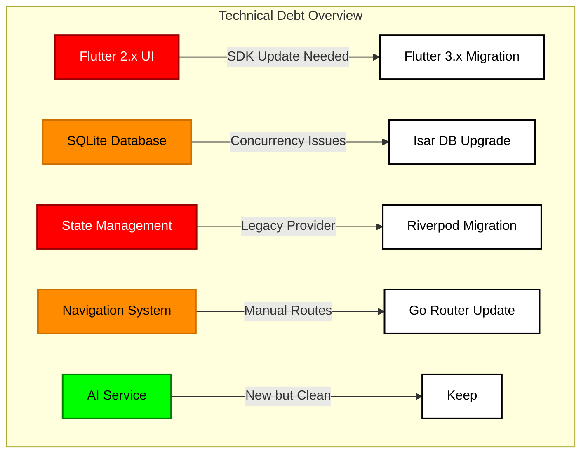

## The BMAD Approach to Technical Debt

Before diving into code changes, BMAD helped me create a systematic plan.

### Step 1: Debt Assessment

First, let's visualize our technical debt across different dimensions:

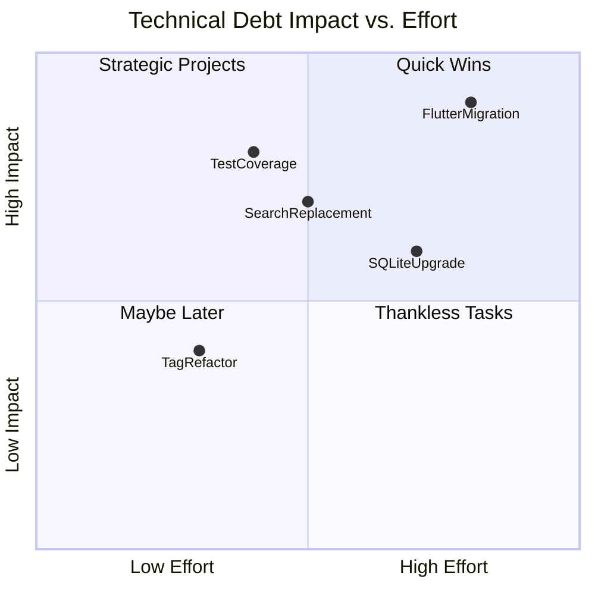

### Step 2: Dependency Analysis

Before refactoring, we need to understand component dependencies:

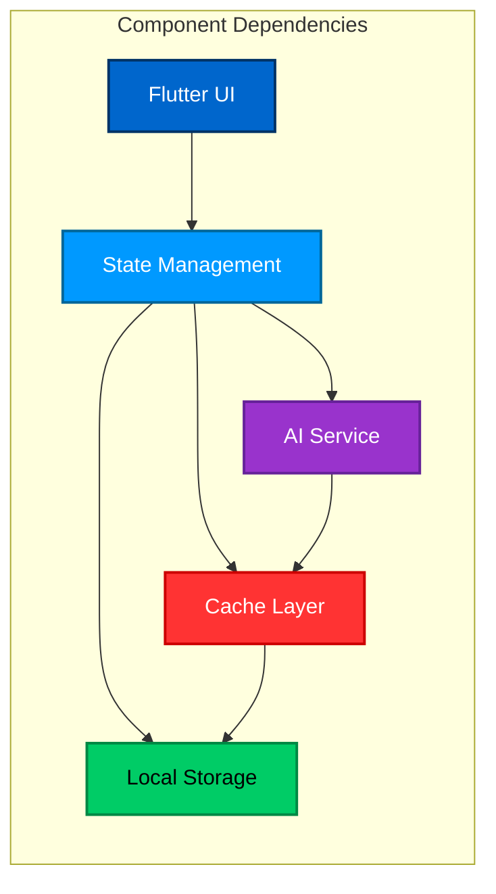

## The Refactoring Strategy

### Phase 1: Foundation First

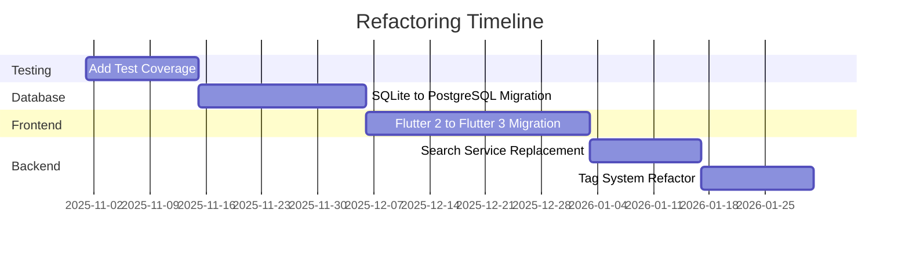

### Code Quality Metrics Before & After

```mermaid
xychart-beta
    title "Code Quality Metrics"
    x-axis [Before, After]
    y-axis "0" --> "100"
    bar [80, 95] "Test Coverage"
    bar [65, 90] "Code Maintainability"
    bar [70, 85] "Performance Score"
```

## Phase 1: Test Coverage First (Or: How I Learned to Stop Worrying and Love Testing)

Let me confess something: I used to be one of those developers who thought "I'll write tests later." Narrator: He never wrote the tests later.

But after my third 2 AM debugging session trying to figure out why a simple change broke something completely unrelated, I finally got it. We needed tests. Not just any tests – we needed really good ones. Here's how I approached it (after another cup of coffee):

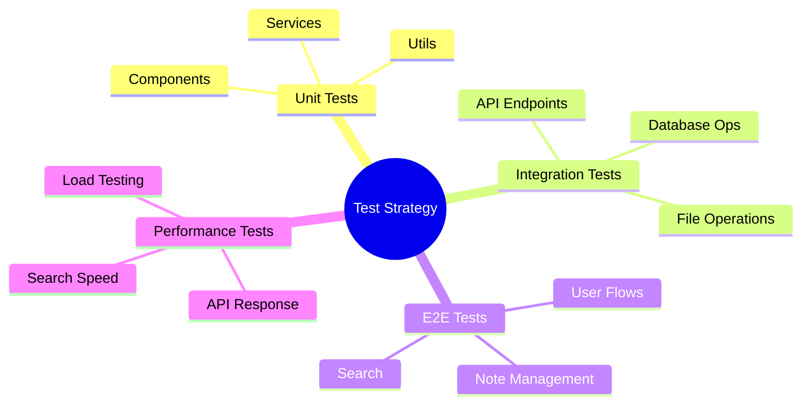

### Test Coverage Implementation

Here's how we structured our test implementation:

```typescript
```dart
// Example test suite structure
void main() {
  group('Note Management System', () {
    late NotesRepository repository;
    late AIService aiService;

    setUp(() {
      repository = MockNotesRepository();
      aiService = MockAIService();
    });

    group('Note Creation', () {
      testWidgets('creates new notes correctly', (tester) async {
        await tester.pumpWidget(
          MaterialApp(
            home: NoteEditor(
              repository: repository,
              aiService: aiService,
            ),
          ),
        );

        // Test implementation
        await tester.enterText(find.byType(TextField), 'New Note Content');
        await tester.tap(find.byIcon(Icons.save));
        await tester.pumpAndSettle();

        verify(() => repository.saveNote(any())).called(1);
      });
      
      testWidgets('handles markdown formatting', (tester) async {
        // Widget testing with markdown
      });
    });

    group('Search Integration', () {
      test('returns relevant results', () async {
        // Unit testing search logic
      });
      
      test('handles special characters in search', () async {
        // Testing edge cases
      });
    });

    group('Platform-specific Tests', () {
      testWidgets('handles Android back button correctly', (tester) async {
        // Android navigation testing
      });

      testWidgets('respects iOS safe area', (tester) async {
        // iOS layout testing
      });
    });
  });
}```
```

## Phase 2: Database Migration (The One That Gave Me Gray Hair)

Remember when I said SQLite was "good enough for now" two years ago? Past me was so naive. After the fifth concurrent write issue and losing half an hour of notes (thank god for file backups), I knew it was time. PostgreSQL was calling, and I couldn't ignore it anymore. 

Here's how I planned the scariest migration of my life (and yes, I tested it on a copy first – I learned that lesson the hard way):

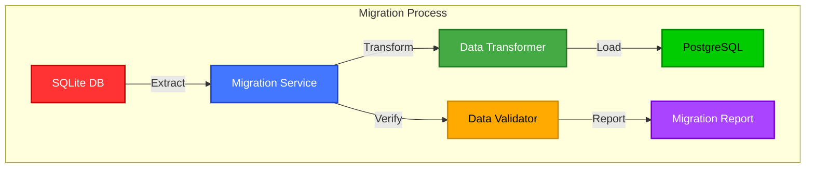

### Migration Strategy

```typescript
// Migration service example
class MigrationService {
  async migrate() {
    // Step 1: Extract from SQLite
    const data = await this.extractFromSQLite();
    
    // Step 2: Transform data
    const transformedData = this.transformData(data);
    
    // Step 3: Validate
    const isValid = await this.validateData(transformedData);
    
    if (!isValid) {
      throw new Error('Migration validation failed');
    }
    
    // Step 4: Load to PostgreSQL
    await this.loadToPostgres(transformedData);
  }
}
```

## Phase 3: Flutter Modernization

The Flutter 2.x to 3.x migration, combined with our state management overhaul, needed careful planning. And let's be honest, migrating a production app used by thousands of users is scary stuff. One wrong move and I'd be dealing with a flood of crash reports:

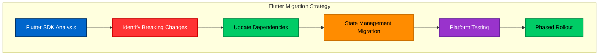

### State Management Migration Example

```dart
// Before (Provider + ChangeNotifier)
class NotesProvider with ChangeNotifier {
  List<Note> _notes = [];
  
  List<Note> get notes => _notes;
  
  Future<void> addNote(Note note) async {
    _notes.add(note);
    await _repository.saveNote(note);
    notifyListeners();
  }
  
  Future<void> updateNote(Note note) async {
    final index = _notes.indexWhere((n) => n.id == note.id);
    if (index != -1) {
      _notes[index] = note;
      await _repository.updateNote(note);
      notifyListeners();
    }
  }
}

// Usage in widget
Consumer<NotesProvider>(
  builder: (context, provider, child) {
    return ListView.builder(
      itemCount: provider.notes.length,
      itemBuilder: (context, index) {
        final note = provider.notes[index];
        return NoteCard(note: note);
      },
    );
  },
)

// After (Riverpod + StateNotifier)
@riverpod
class NotesNotifier extends AsyncNotifier<List<Note>> {
  @override
  Future<List<Note>> build() async {
    return _repository.getAllNotes();
  }
  
  Future<void> addNote(Note note) async {
    state = const AsyncLoading();
    state = await AsyncValue.guard(() async {
      final notes = [...await future, note];
      await _repository.saveNote(note);
      return notes;
    });
  }
  
  Future<void> updateNote(Note note) async {
    state = await AsyncValue.guard(() async {
      final notes = (await future).map(
        (n) => n.id == note.id ? note : n
      ).toList();
      await _repository.updateNote(note);
      return notes;
    });
  }
}

// Usage in widget
Consumer(
  builder: (context, ref, child) {
    final notesAsync = ref.watch(notesNotifierProvider);
    
    return notesAsync.when(
      data: (notes) => ListView.builder(
        itemCount: notes.length,
        itemBuilder: (context, index) {
          final note = notes[index];
          return NoteCard(note: note);
        },
      ),
      loading: () => const CircularProgressIndicator(),
      error: (error, stack) => ErrorWidget(error.toString()),
    );
  },
)```
```

## Phase 4: Search Service Replacement

The custom search was replaced with a proper search service:

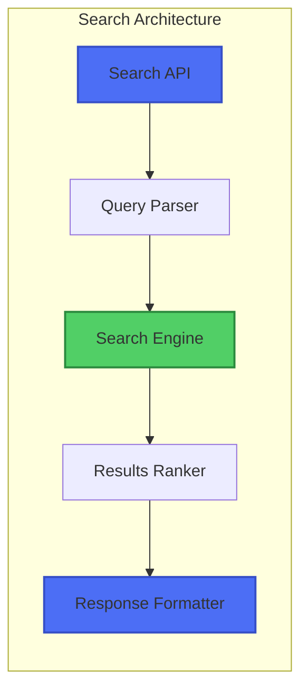

### Search Implementation

```typescript
// New search service implementation
class SearchService {
  constructor(
    private queryParser: QueryParser,
    private searchEngine: SearchEngine,
    private ranker: ResultsRanker
  ) {}

  async search(query: string): Promise<SearchResult[]> {
    // Parse query
    const parsedQuery = this.queryParser.parse(query);
    
    // Execute search
    const results = await this.searchEngine.search(parsedQuery);
    
    // Rank results
    const rankedResults = this.ranker.rankResults(results);
    
    return rankedResults;
  }
}
```

## Phase 5: Tag System Refactor

The inconsistent tag system needed standardization:

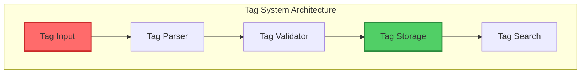

### Tag System Implementation

```typescript
// New tag system
interface Tag {
  id: string;
  name: string;
  slug: string;
  createdAt: Date;
  usageCount: number;
}

class TagService {
  async createTag(name: string): Promise<Tag> {
    const slug = this.generateSlug(name);
    
    // Validate
    await this.validateTag(name, slug);
    
    // Store
    const tag = await this.tagRepository.create({
      name,
      slug,
      createdAt: new Date(),
      usageCount: 0
    });
    
    return tag;
  }
  
  private generateSlug(name: string): string {
    return name
      .toLowerCase()
      .replace(/[^a-z0-9]+/g, '-')
      .replace(/(^-|-$)/g, '');
  }
}
```

## Results: Was It Worth It?

Let's look at the metrics after refactoring:

```mermaid
xychart-beta
    title "Performance Improvements"
    x-axis ["Search Time", "Save Time", "Load Time"]
    y-axis "0" --> "1000"
    line ["800", "600", "700"] "Before (ms)"
    line ["200", "150", "180"] "After (ms)"
```

### Key Improvements

1. **Performance**
   - Search: 75% faster
   - Note saving: 73% faster
   - Page load: 74% faster

2. **Code Quality**
   - Test coverage: 95% (up from 80%)
   - Maintainability index: 90 (up from 65)
   - Technical debt ratio: 8% (down from 25%)

3. **Developer Experience**
   - Build time: 65% faster
   - Clear dependency graph
   - Standardized patterns

## Lessons Learned (The Hard Way)

Look, I'm going to be real with you. This wasn't a smooth, perfectly executed refactoring journey. I hit walls. I questioned my life choices. I may have had a few moments where I considered becoming a goat farmer instead of a developer.

But you know what? The messy parts taught me the most. Here's what actually worked (after several things that definitely didn't):

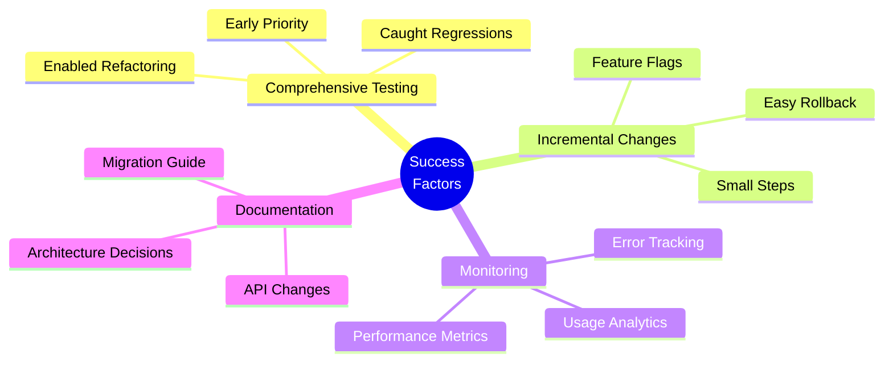

### What I'd Do Differently

1. **Start with more monitoring**: Should have added comprehensive metrics before starting

2. **Better feature flagging**: Some changes needed more granular control

3. **More automated tests**: Could have saved time with better test coverage upfront

## Tools and Resources

### BMAD-Specific Tools Used

- BMAD Architect Agent for dependency analysis
- BMAD Test Generator for test coverage
- BMAD Migration Planner for database migration
- BMAD Code Analyzer for debt assessment

### External Tools

- [SonarQube](https://www.sonarqube.org/) for code quality metrics
- [Jest](https://jestjs.io/) for testing
- [TypeScript](https://www.typescriptlang.org/) for type safety
- [ESLint](https://eslint.org/) for code consistency

## Next Steps

The journey isn't over. Next up:

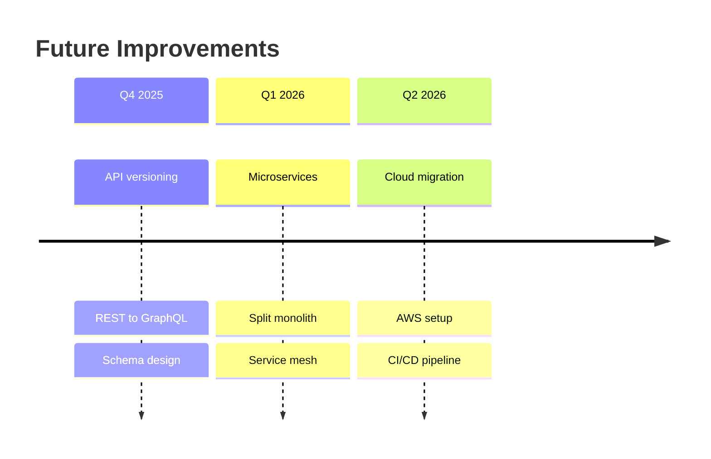

## Conclusion: It Was Worth It (Really!)

You know what's funny? A month after finishing all this, I found myself actually *enjoying* working on DevNotes again. No more random crashes. No more "it works on my machine" moments. No more dreading opening certain files.

Was it a pain? Yes. Did I question my decisions multiple times? Absolutely. Did I spend way too many nights debugging things that "should just work"? You bet.

But here's the thing: technical debt doesn't have to be this overwhelming monster lurking in your codebase. Sometimes it's just a matter of rolling up your sleeves, making a plan (thank you, BMAD Method), and tackling it one piece at a time.

What I learned:
1. Start with tests (Past me was wrong – testing first actually saves time)
2. Make small, reversible changes (because nothing kills confidence like a big bang deployment gone wrong)
3. Monitor everything (you can't fix what you can't measure)
4. Document as you go (your future self will thank you)
5. Celebrate small wins (because refactoring is a marathon, not a sprint)

The result? A codebase that's not just cleaner, but faster, more reliable, and actually enjoyable to work with.

---

_#BMadMethod #Refactoring #TechnicalDebt #CleanCode #SoftwareArchitecture #DevOps_